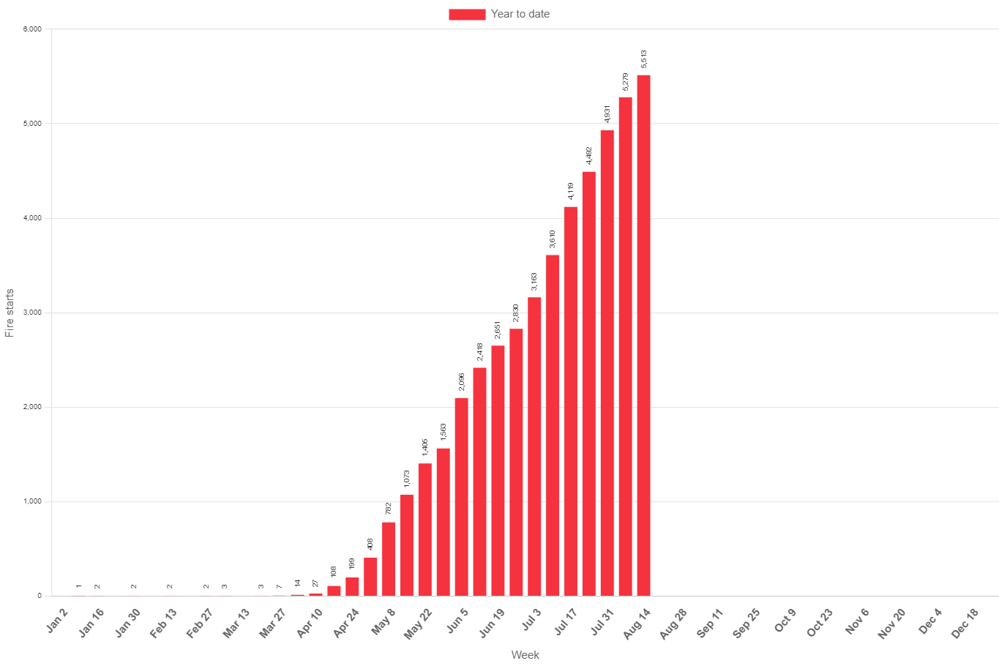

# STAT8123 Assignment 1: Statistical Graphics

## Overview

This repository contains the materials for Assignment 1 in the STAT8123 Statistical Graphics course. The assignment focuses on exploring and critiquing various statistical graphics to enhance understanding and interpretation.

## Assignment Details

The assignment involves the analysis of five distinct statistical graphics from various sources, including news, journals and business websites. Each graphic is accompanied by a set of requirements, including an accurate citation, a rationale for selection, a description/interpretation, and a critique.

The graphics chosen encompass a range of topics, such as environmental events, sports viewership, infographics, business statistics, and a miscellaneous statistical graphic.

## Contents

- 
- `./images/Graphic2.png`: Graphic 2 - [Description]
- `./images/Graphic3.png`: Graphic 3 - [Description]
- `./images/Graphic5.png`: Graphic 5 - [Description]
- `./images/Graphic4.png`: Graphic 4 - [Description]
- `README.md`: This file, providing an overview of the assignment.

## Instructions

1. Clone this repository to your local machine.
2. Review each graphic in the repository.
3. Complete the assignment according to the provided guidelines.
4. For each graphic, update the README file to include details of your analysis, including reasons for selection, descriptions, and critiques.
5. Make sure to follow the specified structure for each graphic's analysis.
6. Edit the README file to reflect your own interpretation and analysis of each graphic.
7. Commit your changes and push them to your repository.

## Contact

For any questions or concerns related to this assignment, please contact me at adityasagave@gmail.com.

---
