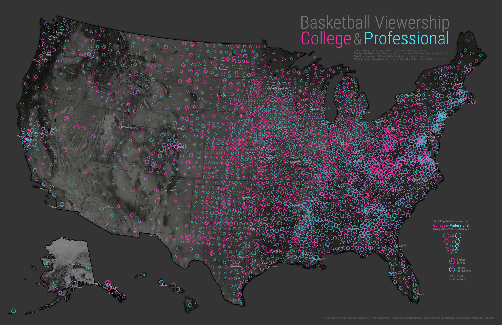
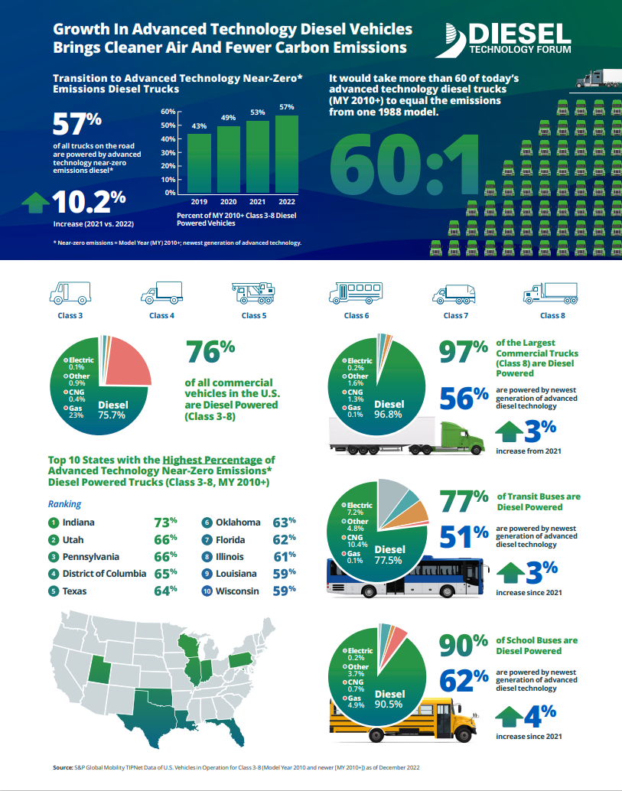
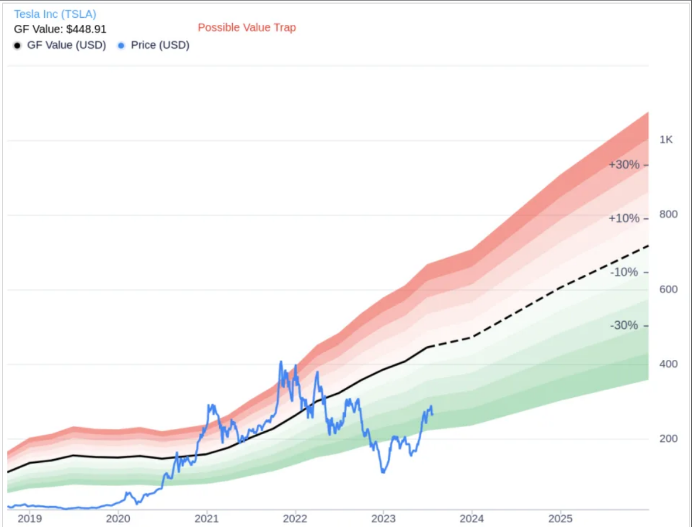
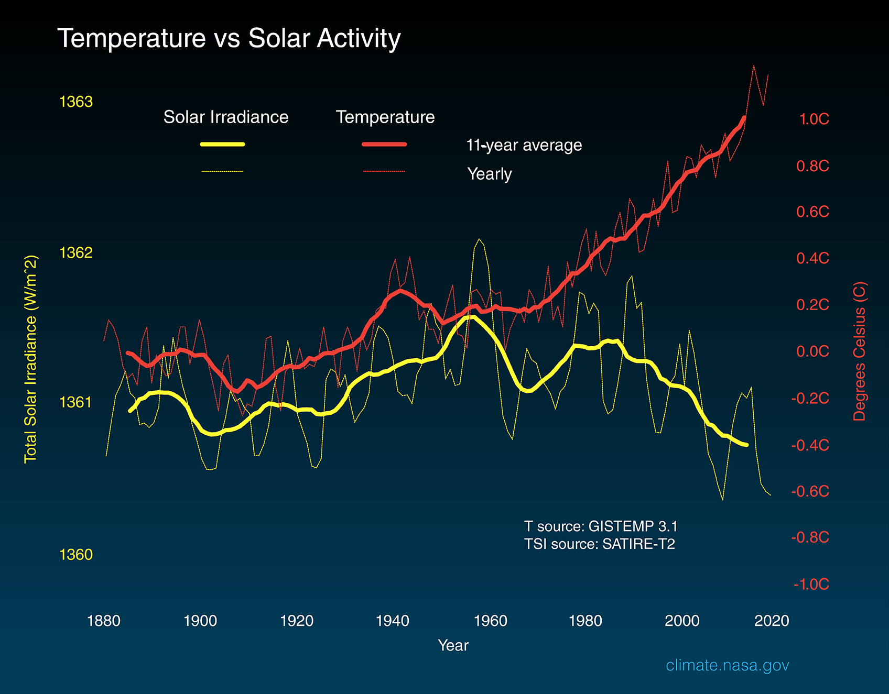

---
output:
  pdf_document: default
  html_document:
    df_print: paged
---

```{r setup, include=FALSE}
knitr::opts_chunk$set(echo = TRUE)
```

# STAT-8123: Interpreting and Critiquing Statistical Graphics
Name: Aditya Sagave  
Student Id: 47541164

\newpage

### **Graphic 1**: A statistical graphic on bushfires/wildfires in Canada, 2023

{width=30%}

### Citations: 
Image URL: https://ciffc.net/statistics

### Reason for Choosing the Graphic:

The graphic serves to depict the devastating bushfires that occurred in Canada. These massive fires wreaked havoc and significantly impacted the air quality. In June 2023, the skies over New York City turned a vivid shade of orange, reminiscent of a scene from the movie "Blade Runner 2049." This phenomenon was attributed to the bushfires in various regions of Canada. Due to this I was curious to know the statistics regarding the total number of bushfires that occurred in Canada throughout the entire year of 2023, not just limited to the month of June.

### Description/Interpretation:

The graphic features a visually appealing bar plot that effectively portrays the progression of bushfires in Canada. The use of a vibrant red color immediately captures the attention of users. The X-axis spans from January 2 to December 18, with a one-week interval between each point. Meanwhile, the Y-axis represents the number of bushfires that occurred during the corresponding time frames on the X-axis. The Y-axis values range from 0 to 5000, with intervals of 1000. Each bar plot is accompanied by a specific numerical value indicating the exact number of bushfires that took place within that particular time frame. This information is presented at the top of each bar plot.

### Critique:

#### Tools and Principles:

The graphic employs a Barplot graph with the number of bushfires occurring on top of each barplot. The color scheme effectively conveys the number of fires in each particular week. The inclusion of axis labels and the title enhances the plot's contextual understanding, particularly when accessed on a website.

#### Strengths and Weaknesses:

One of the notable strengths of this graphic is its consistent use of color schemes throughout the plot.This consistency allows users to focus on the statistical data presented rather than being distracted by the design elements. Color choice is good as the color red intuitively associates with fire. The display of specific fire counts on each barplot serves a dual purpose—providing a quick estimate of fire occurrence by glancing at the y-axis, and enabling precise numeric values to be gleaned. Moreover, the evenly spaced arrangement of the barplots enhances readability.

However, there are a few weaknesses worth addressing. The title "fires by week" lacks specificity, leaving room for confusion. A more detailed title could provide essential context, such as the geographical region of the fires and the year covered in the graphic. Furthermore, there is noticeable unused space on the left and right sides of the peak of the bar plot, particularly during the periods from January 2nd to March 27th and from August 28th to December 18th. To enhance clarity, the y-axis label should explicitly indicate "number of fires" or "Frequency of fires." Additionally, the absence of a caption deprives viewers of a crucial context or message that the graphic aims to convey.

### **Graphic 2**: A choropleth/thematic map relating to sport

{width=30%}

### Citations: 
Website URL: https://www.esri.com/arcgis-blog/products/analytics/analytics/the-weird-world-of-a-cartographers-brain-and-basketball/

Image URL: https://adventuresinmapping.files.wordpress.com/2017/02/college_pro_rings.jpg

### Reason for Choosing the Graphic:

The choropleth map depicts the viewership of Basketball: college and professional in USA, 2017. It serves as a bivariate map created by John Nelson that that shows viewership and population. This map helps to show not only where people tend to favor college or pro basketball, but also where people actually live.

### Description/Interpretation:

Using Esri Demographic data, Nelson created a choropleth map that illustrates the ratio of college viewership to professional viewership via standard deviations. The map shows that there is a clear regional pattern in viewership preferences, with college basketball being more popular in the Midwest and Appalachia, and professional basketball being more popular in the coasts and urban areas. The creator uses circles with varying sizes and colors to describe the which family it belongs to (college or professional) and the percentage of the populations.

### Critique:

#### Tools and Principles:

The map employs a combination of colors, labels, symbols, and symbol sizes to efficiently convey the intended message without an excessive amount of textual information. The creator utilized a terrain map of the USA as the backdrop and overlaid it with various symbols, specifically circles with varying sizes and colors. These circles serve to indicate the category of the entity and the percentage of the population associated with that particular state in the USA.

#### Strengths and weaknesses:

A notable strength of this map is its effective utilization of a well-thought-out color scheme and a single symbol (circles) to represent distinct categories (college and professional). This design choice greatly facilitates the identification of patterns across the map. The presence of a clear title for the map and an informative legend situated at the bottom right corner enhances its usability. The incorporation of a black border surrounding the entire country serves to focus attention solely on the pertinent areas of the map, preventing distraction from other regions.

In addition to its strengths, there are several areas in which the map could benefit from improvement. While the use of circles helps in visualizing population distribution based on preferences, the map has a potential for confusion due to overlapping circles. In instances where states have equal percentages of population with varying preferences, overlapping circles might lead viewers to perceive only one category, mistakenly assuming the absence of the other. Moreover, the choice of a terrain map introduces darker grey shades, especially in mountainous areas, potentially wasting ink and making the background visually cluttered. Furthermore, the map's title and description employs a shade of grey that might pose readability challenges for some readers. The font size of the description is notably small, contributing to further reading difficulties. Addressing these aspects could enhance the overall accessibility and clarity of the map's content.

### **Graphic 3**: A statistical infographic (it must contain statistical information, such as charts and summary
statistics) published within the last 2 years.

{width=30%}

### Citations: 
Image URL: https://dieselforum.org/trucking

### Reason for Choosing the Graphic:

Since EVs vehicles are domination the roads of USA, but at this time EV battery vehicles can be only seen in cars not truck. This generates a curiosity on how does truck use diesel efficientlt since in near future the petroleum will go extent and they hve to eventually use EV batteries but until then what is the current importance of diesels in trucking sector?

### Description/Interpretation:

The graphic highlights diesel's dominance in trucking and showcases key data concisely. The "60:1" ratio, equating a modern truck's $CO_2$ emissions to 60 older models, grabs attention. It categorizes six truck types and explores Class 3 to Class 8 models, providing depth. Data on advanced tech and near-zero emissions display environmental efforts, by state. In sum, it communicates the impact of emissions, details vehicle classes comprehensively, and underscores emission reduction progress.

### Critique:

#### Tools and Principles:

The graphic adeptly utilizes a blend of textual information, imagery, ratios, and charts including pie charts and bar plots to effectively communicate the message about modern trucks equipped with advanced technology and nearly zero emissions. Through the use of multiple pie charts, it vividly presents the breakdown of different truck types, such as class 8, indicating the percentage distribution of fuel sources—diesel, CNG, electric, and other options. This comprehensive approach successfully conveys how today's trucks are embracing innovation and environmentally friendly practices while offering clear insights into the fuel composition across various vehicle categories.

#### Strengths:

The graphic excels in providing comprehensive statistics on technology adoption and near-zero emissions in the trucking sector (2019-2022). Within a confined space, it offers a clear bar plot with additional context, showcasing the tech/near-zero emission truck percentage and the 2021-2022 growth. It visually illustrates vehicle types. The pie chart efficiently categorizes class 3 to class 8 trucks by fuel type (diesel, CNG, gas, electric, other). Additionally, a map and table spotlight the top 10 states with highest tech near-zero emission diesel trucks (class 3-class 8), enhancing insights. This graphic masterfully conveys industry progress.

#### Weakness:

In my perspective, there are certain areas that could be improved in the graphic. The choice of color for "60:1" and the bar plot might not be optimal, given the already existing blue and green gradient background. To economize on ink and streamline the visual, the depiction of 60 trucks could be omitted. Implementing a single legend for the pie charts' labels would enhance clarity rather than repeating them within each chart.

However, a notable issue arises with the map and its accompanying table. The differentiation between the first three states marked in green and the remaining states in blue lacks explanation. A clear rationale for this distinction should be provided to prevent confusion among viewers. Addressing these aspects could enhance the overall effectiveness and coherence of the graphic.

### **Graphic 4**: A statistical graphic relating to business.

{width=30%}

### Citations: 
Image URL: https://finance.yahoo.com/news/tesla-tsla-value-trap-depth-203133943.html

### Reason for Choosing the Graphic:

Upon arriving in Australia, I had my first experience riding in a Tesla model. This sparked my curiosity about Tesla's current market earnings. I sought to analyze their stock price, understand their significant revenue growth, and comprehend the factors driving their exponential increase in production over the past few years.

### Description/Interpretation:

The graphic adeptly portrays Tesla's stock value progression from 2019 to 2023, with an extension into the future, possibly beyond 2025. The presentation seamlessly integrates actual historical data and projected figures, streamlining the comparison process. This comprehensive approach allows for a single graph to convey both present and future trends, saving time and facilitating insight. The graph centers around Tesla's stock price, while also suggesting the potential concern of its soaring value becoming a value trap.

### Critique:

#### Tools and Principles:

The graphic artfully combines line plots, trend lines, and color coding. This amalgamation efficiently illustrates the actual and predicted data on a single graph, eliminating the need to study two separate graphs for comparison. The graph maintains consistency in data representation and adheres to uniform intervals on both the X and Y axes. While placing Y-axis values on the right might be an option, the convention of placing them on the left aligns with the left-to-right reading pattern.

#### Strengths:

One key strength lies in the effective use of a trend line and color coding to illustrate Tesla's projected stock price and identify potential value trap situations. The color shades are well-chosen for distinction without overwhelming the viewer. The white background conserves ink and enhances readability. The graph's intervals (1 year on X-axis, $200 on Y-axis) facilitate quick comprehension. The addition of percentage values (-30%, -10%, +10%, +30%) provides insight into anticipated stock price changes.

#### Weakness:

While the graphic does possess strengths, there are several areas in need of improvement. The absence of labels on both the X and Y axes can be misleading to readers. A proper legend is missing, making it challenging to discern between different components. Instead of using red text to indicate a value trap, a more appropriate approach for clarity should be employed. The single continuous trend line representing the GF (Intrinsic value estimate) could be enhanced by explicitly indicating the shift to dashed lines for future projections, preferably through a legend. The Y-axis lacks a starting point for stock prices, beginning directly from $200. Similarly, the X-axis lacks an endpoint beyond 2019, leaving readers uncertain about the extent of predictions. Although the percentage values (-30%, -10%, +10%, +30%) aid interpretation, an additional legend associating these percentages with their respective shades would provide readers with more detailed understanding and comparison.

### **Graphic 5**: A statistical graphic of your choice.

{width=30%}

### Citations: 
Image URL: https://climate.nasa.gov/climate_resources/189/graphic-temperature-vs-solar-activity/

### Reason for Choosing the Graphic:

With the installation of solar panels on our house, my curiosity was piqued about the amount of solar energy that radiates from the sun, essential for charging the solar cells. Recognizing NASA's utilization of advanced instrumentation for sun energy measurement, I opted to study their data. This graphic seemed ideal to understand the precise energy and heat Earth receives from the sun, even while being 151.61 million km away.

### Description/Interpretation:

This graphic portrays a comparison of global surface temperature changes (red line) and the Sun's energy received by the Earth (yellow line) in watts (units of energy) per square meter since 1880. The lighter/thinner lines show the yearly levels, while the heavier/thicker lines show the 11-year average trends. Eleven-year averages are used to reduce the year-to-year natural noise in the data, making the underlying trends more obvious.

### Critique:

#### Tools and Principles:

The graphic predominantly employs a line plot to illustrate the variations in temperature (represented by the red line) and the solar energy received by Earth from the sun (depicted by the yellow line). Notably, the graphic maintains a consistent approach to representing data and ensures uniform intervals on both the X and Y axes.

#### Strengths:

The specialty of this graphic is that the creator has introduced two y-axis concepts where one measures the Sun's energy received by the Earth (yellow line) and the other measure the global surface temperature changes (red line) which eliminates the need to compare two different graphics and saves time as well. The lines have two type i.e Thick and Thin.  Thin lines depict yearly levels, while thicker lines show 11-year averages. Clearly labeled axes prevent confusion. A prominent title enhances clarity, and a comprehensive legend explains sample lines.

#### Weakness:

However, there are several noteworthy weaknesses that warrant attention. Despite the visual appeal of this graphic, the absence of grid lines could undermine its readability. The gradient-filled background (black at the top transitioning to blue at the bottom) might be deemed inefficient in terms of ink usage, as indicated in lecture notes. While labels are provided with their corresponding units (e.g., Total Solar Irradiance in W/$m^2$), the use of technical units like W/$m^2$ might pose challenges for non-technical audiences. Including a brief explanation or expansion of the abbreviation would aid those unfamiliar with the technical terminology, enhancing their comprehension of the graphic's intended message.